# stock-market-analysis

<b> Project Link: https://github.com/ratnesh2001/stock-market-analysis <\b>
## About
<b>In this project, I have scrapped and compared top 4 Technologies companies listed in National Stock Exchange, India. The different types of comparison are listed below:</b>

## 1. Comparing Stock Prices
### In same Scale
<figure class="image">
  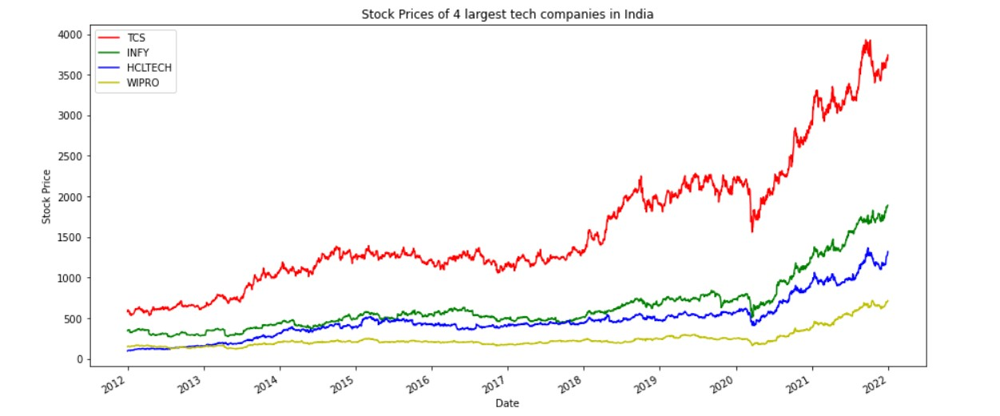
</figure>

### In different Scale
<figure class="image">
  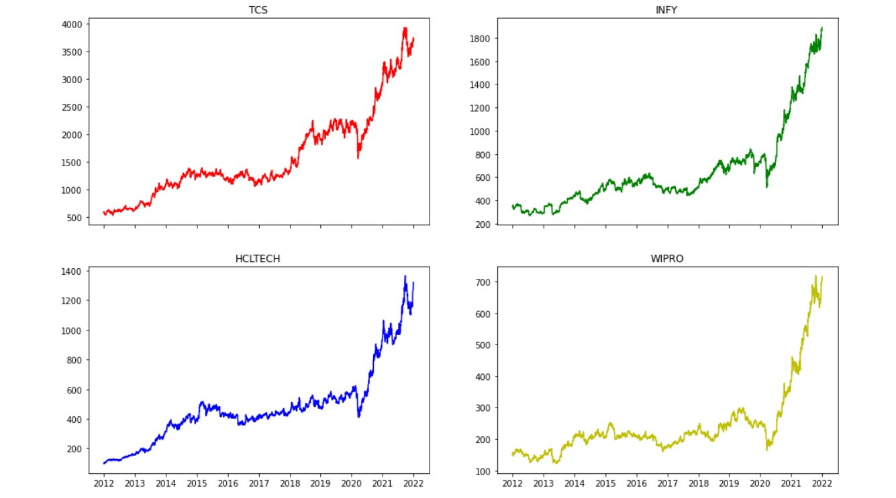
</figure>

## 2. Correlation between all 4 stocks
<figure class="image">
  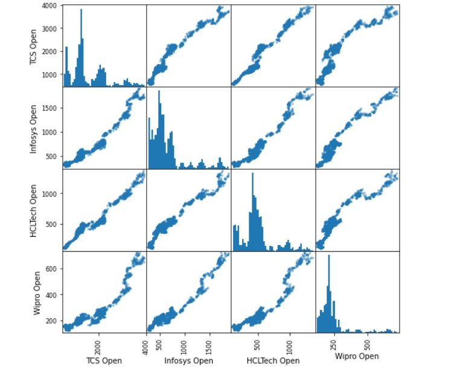
</figure>

## 3. Comparing Volumes Traded
### In Same Scale
<figure class="image">
  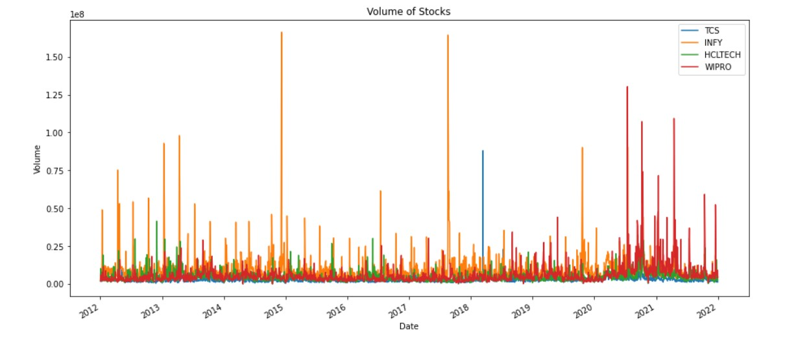
</figure>

### In Individual Graphs
<figure class="image">
  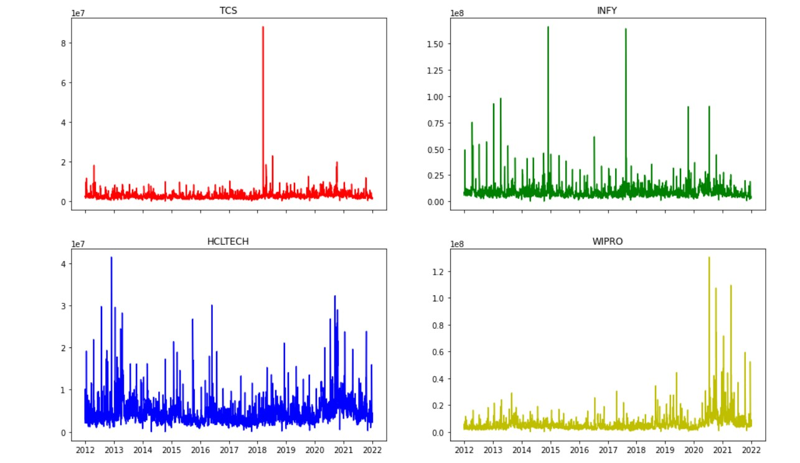
</figure>
The spike in volumes generally correlates with an event related to that company.

## 4. Price with 100 days EMA and 200 days EMA
<figure class="image">
  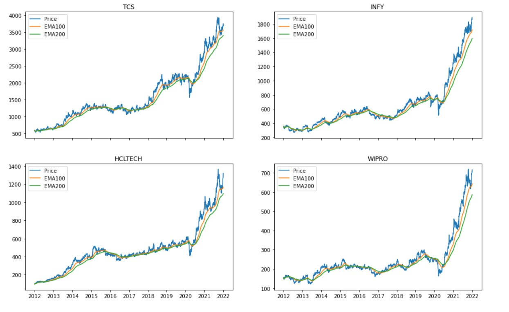
</figure>

## 5. Volatility - Daily Percentage Change
### Histogram of Daily percentage change
<figure class="image">
  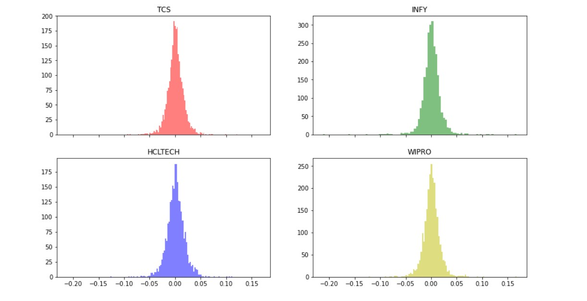
</figure>

### Comparing probablity distribution of daily percentage change
<figure class="image">
  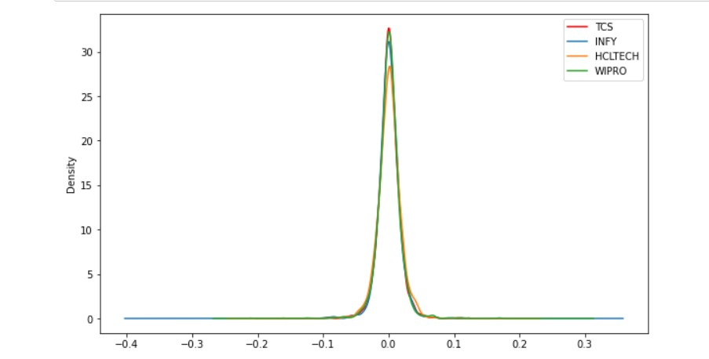
</figure>

### Comparing them in box plot
<figure class="image">
  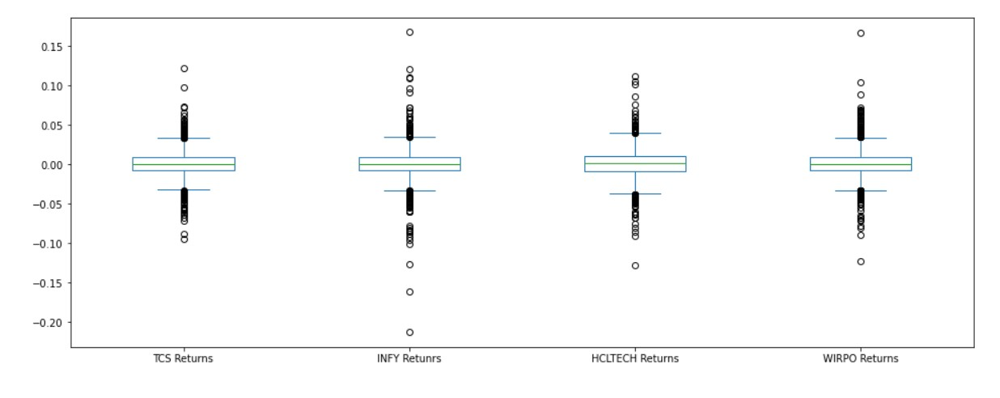
</figure>

## 6. RSI OF TCS
<figure class="image">
  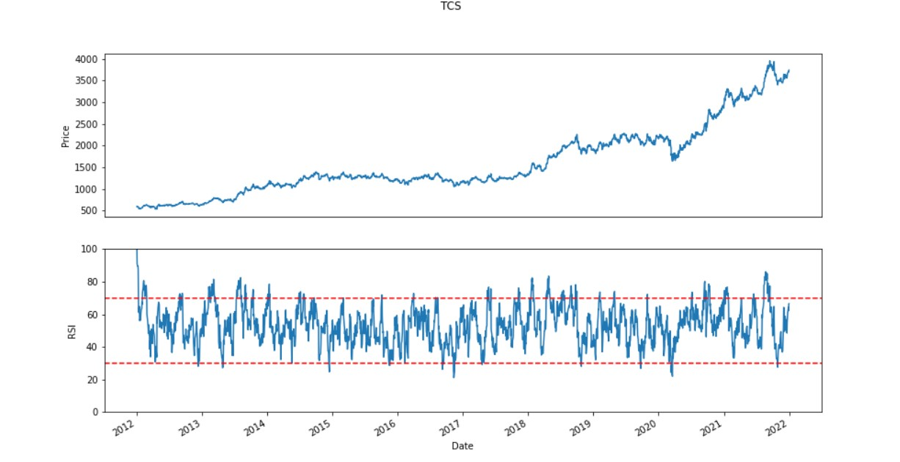
</figure>

## 7. Cummulative Return of all stocks
What would be the cummulative return of all companies if you invest 1 unit in each
<figure class="image">
  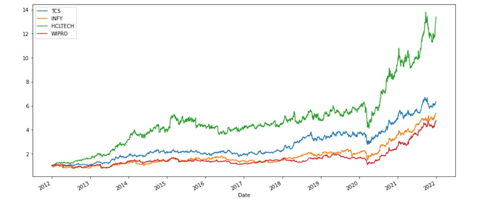
</figure>
